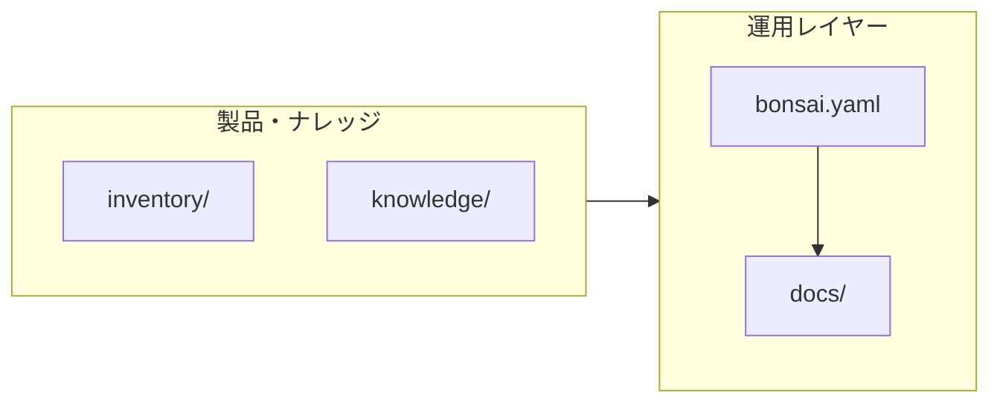

# BaaC: Bonsai as a Code

## Powered by LOB（Landscape Oracle BONSAI）

### リポジトリ仕様

| 項目 | 値 |
|------|-----|
| **Document ID** | `BAAC-REPO-001` |
| **Status** | Active |
| **Version** | 1.0 |
| **スコープ** | 盆栽の宣言的スペック、運用手順、トラブルシュート、および LOB 製品ラインのドキュメント。 |

---

## 🌱 "The Original Tree Structure. Deploy to Your Desk."

### 1. 目的（Purpose）

**BaaC:** 植物を「機械的でプログラムのように振る舞うオブジェクト」として扱い、育成操作をデプロイメント／メンテナンスの語彙で共有する。新芽を摘む（プチプチする）行為は **マイクロ・リファクタリング**、手に残るヒノキの香りは **嗅覚フィードバック** として位置づける。

私が長年植物に携わり感じたことは「植物は非常に機械的でプログラムのように振る舞う」と感じることです。とても機械的に反応してきます。そのためコードとして植物（盆栽）を捉え、ハードルを下げたいと思っています。

**LOB:** 伝統的な盆栽の美学を現代のエンジニアリング視点で再解釈した BaaC プロジェクトとして、ツリー構造と永続化オブジェクトが物理世界に出現する――そんなハッカーの夢を、ノード単位で「剪定（リファクタ）」し、「水やり（定期アップデート）」し、「バグ（枯れ）」を日々デバッグするオープンソース・プロジェクトです。

---

### 2. システム構成（System Context）

| アーティファクト | 説明 |
|------------------|------|
| [`bonsai.yaml`](bonsai.yaml) | 本盆栽の **単一情報源（SSOT）**。種別・寸法・電源・実行環境を宣言。 |
| [`docs/operation.md`](docs/operation.md) | **Update**（水やり）／**Refactoring**（芽摘み）の手順書。 |
| [`docs/troubleshooting.md`](docs/troubleshooting.md) | **Bug** 相当（葉の変色など）の観測・切り分けガイド。 |
| [`.github/ISSUE_TEMPLATE/`](.github/ISSUE_TEMPLATE/) | 購入者向け **育成相談**／**トラブル報告** の Issue テンプレート。 |

---

### 3. Hardware Specs: Stable Build v1.0

数値・種名の正は [`bonsai.yaml`](bonsai.yaml)。概要は以下のとおり。

| Component | Specification |
|:---|:---|
| Machine | Live Juniperus Chinensis var. Shimpaku（真柏） |
| Board | 専用盆栽鉢 ＆ 独自配合土（Root System Optimized） |
| Power | USB Type-C 5V/2A |
| Accessories | 開発用LED ＆ デバッグ・ピンセット |
| Patch | Legacy Port Patch（A to C Adapter） |
| Interface | AI "Landscape Oracle BONSAI" (Beta Access) |

---

### 4. Operation: DevOps

- **Initial Setup**: 外部電源（USB）を接続し、ライフサイクルを開始してください。
- **Runbook**: 詳細は [`docs/operation.md`](docs/operation.md)（Update / Refactoring）。
- **Incident**: [`docs/troubleshooting.md`](docs/troubleshooting.md) および GitHub **New issue** → テンプレート。
- **Support**: 状態の異常検知・最適化の相談は AI "Landscape Oracle BONSAI" へ。

---

### 5. Landscape Oracle BONSAI (AI)

同梱のQRコードから、25年以上の知見を学習した専用AIへアクセス可能です。

- **デバッグ支援**: 「葉の色」「樹勢」等の事象に対し、適切な対処法を提案します。
- **リファクタリング・ガイド**: 盆栽の樹形を美しく整えるための設計思想をガイドします。

※AIはユーザーの入力をサポートするものであり、自動通知機能は搭載されていません。

---

### 6. リポジトリ内のその他パス（参考）

| パス | 役割 |
|------|------|
| [`docs/it-tribe-manifesto/`](docs/it-tribe-manifesto/) | IT トライブ向けマニフェスト |
| [`inventory/`](inventory/) | 出品・在庫関連。**価格・同梱内容は各 Instance ファイルで管理。** |
| [`knowledge/bonsai/`](knowledge/bonsai/) | 季節管理・剪定などのナレッジ |
| [`system/line-bot/`](system/line-bot/) | LINE 連携スクリプト |
| [`prompts/bonsai/`](prompts/bonsai/) | AI 用プロンプト |

---

**"Bonsai is Object-Oriented Life."**

by 株式会社緑酔園 / Ryokusuien Co., Ltd.
